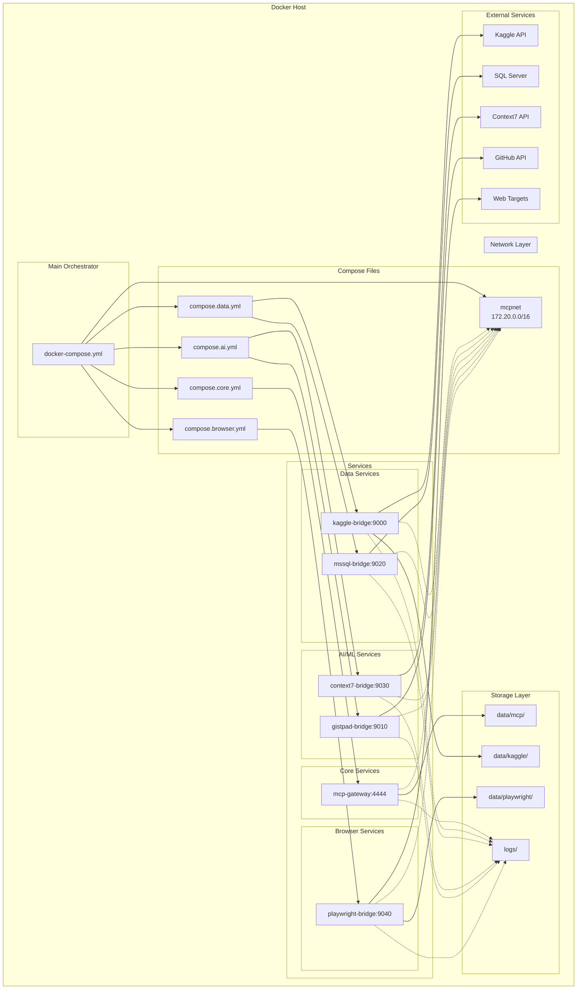
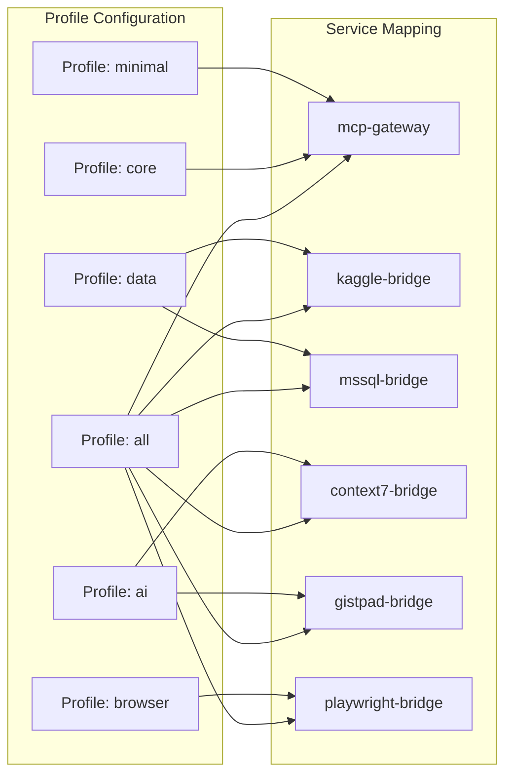
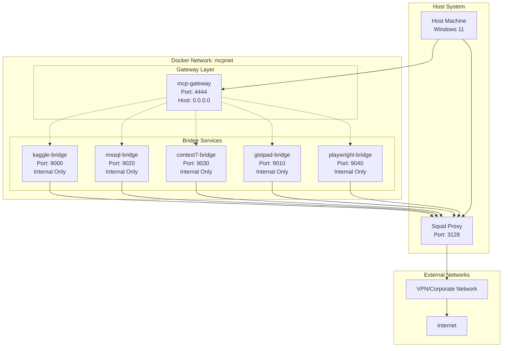
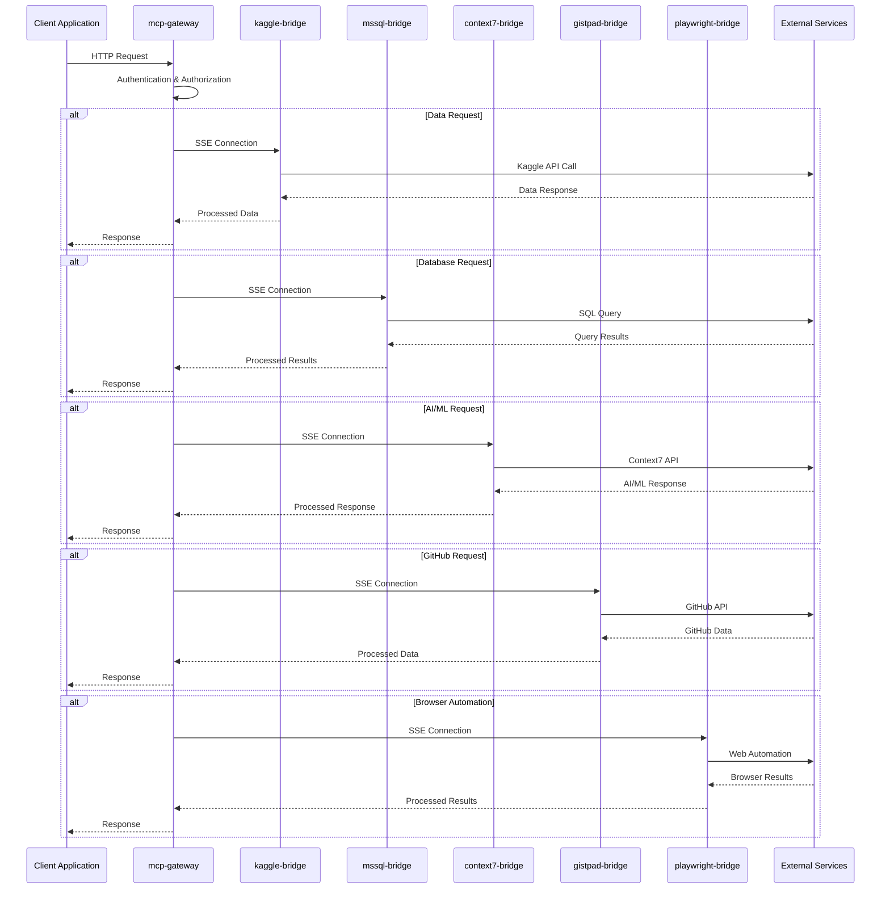
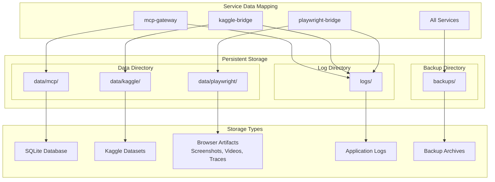
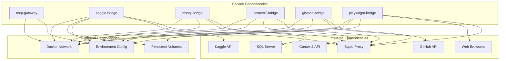

# Architecture Diagram for Restructured Docker MCP Gateway

## System Architecture Overview



## Profile-Based Service Grouping



## Network Architecture



## Data Flow Architecture



## Storage Architecture



## Security Architecture

```mermaid
graph TB
    subgraph "Security Layers"
        subgraph "Authentication Layer"
            JWT[JWT Authentication]
            BASIC[Basic Auth]
            ADMIN[Admin API]
        end
        
        subgraph "Network Security"
            DOCKER_NET[Docker Network Isolation]
            PROXY[Proxy Configuration]
            FIREWALL[Host Firewall]
        end
        
        subgraph "Data Security"
            SECRETS[Environment Secrets]
            ENCRYPT[Data Encryption]
            BACKUP_SEC[Secure Backups]
        end
        
        subgraph "Container Security"
            LIMITS[Resource Limits]
            USER[Non-root User]
            HEALTH[Health Checks]
        end
    end
    
    subgraph "Protected Assets"
        SERVICES[Container Services]
        DATA[Persistent Data]
        API[External API Access]
    end
    
    JWT --> SERVICES
    BASIC --> SERVICES
    ADMIN --> SERVICES
    
    DOCKER_NET --> SERVICES
    PROXY --> API
    FIREWALL --> SERVICES
    
    SECRETS --> SERVICES
    ENCRYPT --> DATA
    BACKUP_SEC --> DATA
    
    LIMITS --> SERVICES
    USER --> SERVICES
    HEALTH --> SERVICES
```



## Deployment Architecture

```mermaid
graph TB
    subgraph "Development Environment"
        DEV_HOST[Dev Machine]
        DEV_COMPOSE[docker-compose.yml]
        DEV_ENV[.env.dev]
        DEV_DATA[./data]
    end
    
    subgraph "Staging Environment"
        STAGE_HOST[Staging Server]
        STAGE_COMPOSE[docker-compose.yml]
        STAGE_ENV[.env.staging]
        STAGE_DATA[/opt/mcp/data]
    end
    
    subgraph "Production Environment"
        PROD_HOST[Production Server]
        PROD_COMPOSE[docker-compose.yml]
        PROD_ENV[.env.prod]
        PROD_DATA[/var/lib/mcp]
        MONITOR[Monitoring Stack]
    end
    
    subgraph "Configuration Management"
        GIT[Git Repository]
        CI[CI/CD Pipeline]
        SECRETS_MGR[Secret Manager]
    end
    
    DEV_COMPOSE --> GIT
    STAGE_COMPOSE --> GIT
    PROD_COMPOSE --> GIT
    
    GIT --> CI
    CI --> STAGE_HOST
    CI --> PROD_HOST
    
    SECRETS_MGR --> DEV_ENV
    SECRETS_MGR --> STAGE_ENV
    SECRETS_MGR --> PROD_ENV
    
    MONITOR --> PROD_HOST
```

## Service Dependencies



This architecture diagram provides a comprehensive visual representation of the restructured Docker MCP Gateway system, including service relationships, network topology, data flow, security layers, and deployment patterns.